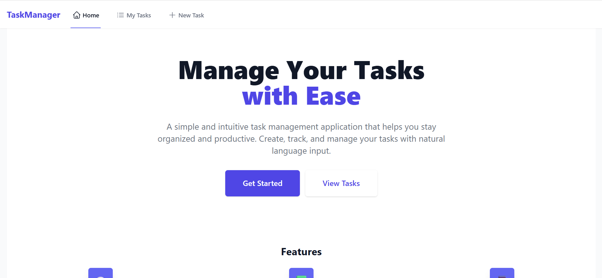
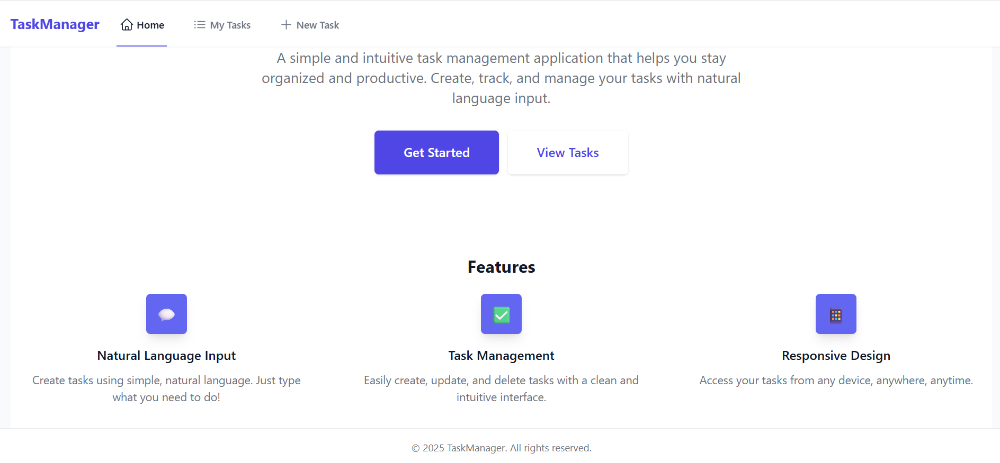
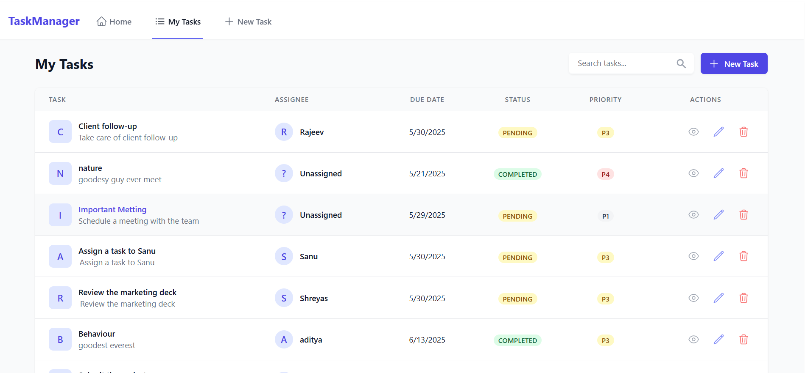
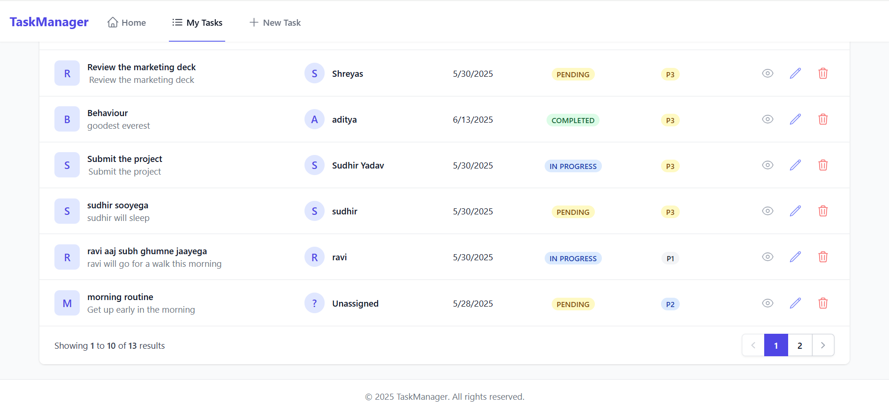
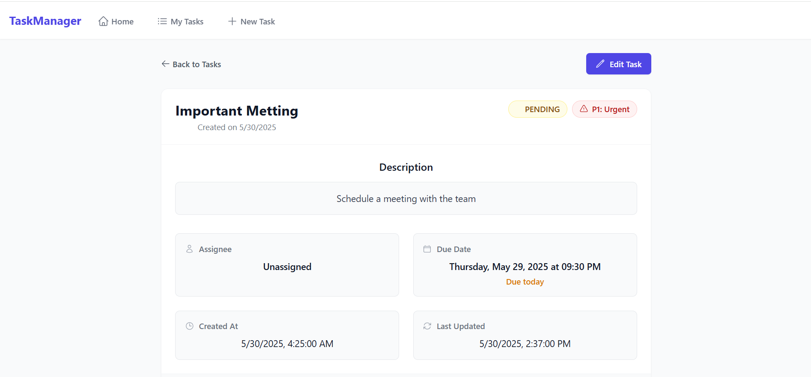
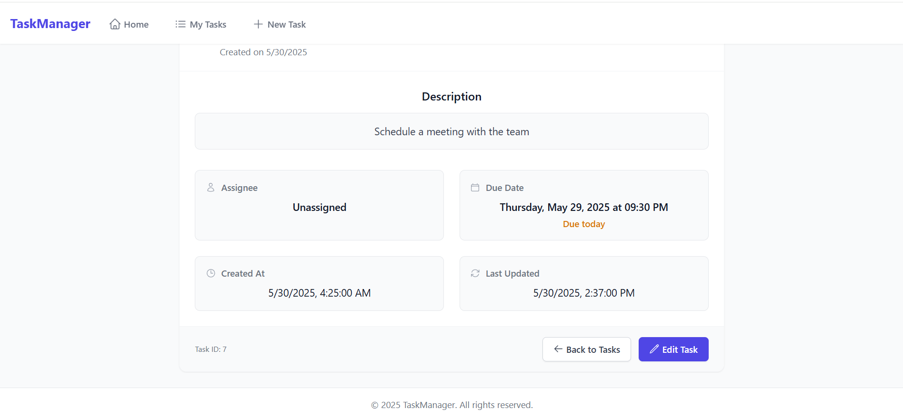
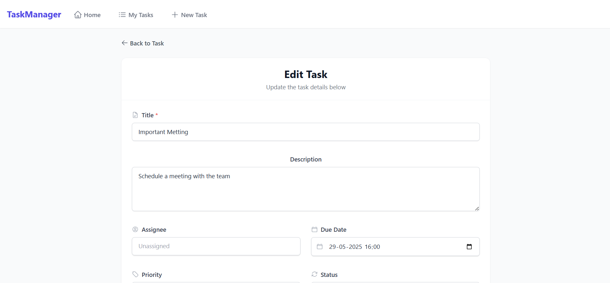
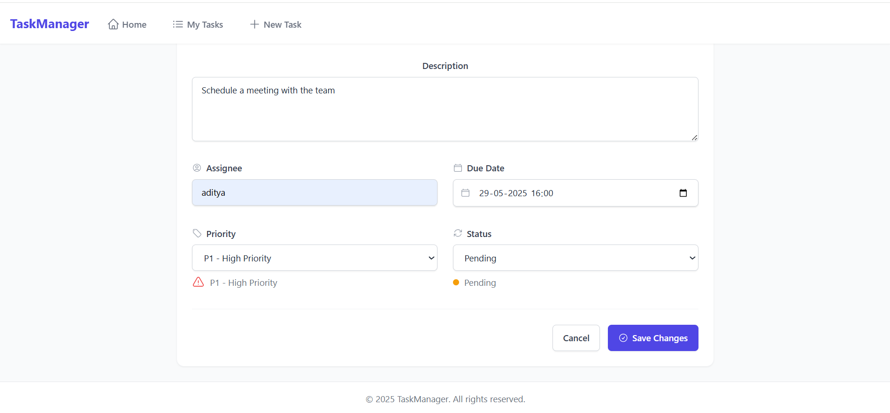
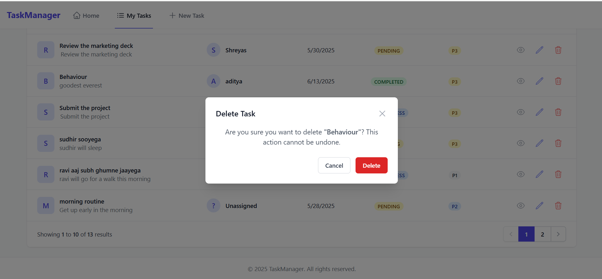

# Task Manager Application

A modern, full-stack task management application built with React, Spring Boot, and PostgreSQL. This application helps teams and individuals organize, track, and manage their tasks efficiently.

## 🚀 Features

- **Task Management**: Create, read, update, and delete tasks
- **Intuitive UI**: Clean and responsive interface built with Tailwind CSS
- **Task Prioritization**: Categorize tasks by priority (P1-P4)
- **Search & Filter**: Quickly find tasks using search and filter options
- **Responsive Design**: Works on desktop and mobile devices
- **Natural Language Processing**: Create tasks using natural language input

## 🖼️ Screenshots

<!-- Add your screenshots here -->
<div style="display: grid; grid-template-columns: repeat(2, 1fr); gap: 20px; margin: 20px 0;">
  <div>
    <h3>1. Preview</h3>
    <p><em>Add screenshot of the applicatione</em></p>
    
    
    
    
    
    
    
    
    
  </div>
</div>

## 🛠️ Tech Stack

### Frontend
- React 18
- React Router v6
- Tailwind CSS
- Axios for API calls
- Hero Icons

### Backend
- Java 17
- Spring Boot 3.x
- Spring Data JPA
- PostgreSQL
- Maven

## 🚀 Getting Started

### Prerequisites

- Node.js (v16 or later)
- Java 17 or later
- PostgreSQL
- Maven

### Backend Setup

1. Clone the repository
   ```bash
   git clone [your-repository-url]
   cd TaskManager/backend
   ```

2. Configure the database in `src/main/resources/application.properties`
   ```properties
   spring.datasource.url=jdbc:postgresql://localhost:5432/your_database
   spring.datasource.username=your_username
   spring.datasource.password=your_password
   ```

3. Build and run the application
   ```bash
   mvn spring-boot:run
   ```
   The backend will be available at `http://localhost:8081`

### Frontend Setup

1. Navigate to the frontend directory
   ```bash
   cd ../frontend
   ```

2. Install dependencies
   ```bash
   npm install
   ```

3. Start the development server
   ```bash
   npm run dev
   ```
   The frontend will be available at `http://localhost:5173`

## 📝 API Documentation

The API documentation is available at `http://localhost:8081/swagger-ui.html` when the backend is running.

## 🤝 Contributing

1. Fork the project
2. Create your feature branch (`git checkout -b feature/AmazingFeature`)
3. Commit your changes (`git commit -m 'Add some AmazingFeature'`)
4. Push to the branch (`git push origin feature/AmazingFeature`)
5. Open a Pull Request

## 📄 License

This project is licensed under the MIT License - see the [LICENSE](LICENSE) file for details.

## 👏 Acknowledgements

- [React](https://reactjs.org/)
- [Spring Boot](https://spring.io/projects/spring-boot)
- [Tailwind CSS](https://tailwindcss.com/)
- [Hero Icons](https://heroicons.com/)

---

<div align="center">
  Made with ❤️ by Shanu
</div>
